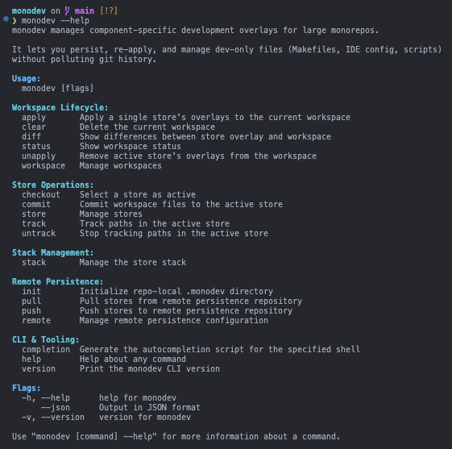
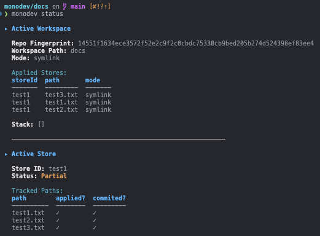

# monodev

I frequently work with a giant monorepo consisting of countless components nested at varying depths. Because of its scale, it has a noticeable memory footprint on my machine and imposes subotimal landscape for AI agents. 

To work around this, I selectively open individual components as isolated IDE workspaces, manually excluding irrelevant directories via settings.json. And during developing, I would additionally add various component-specific artifacts such as .cursor, Makefile, AGENTS.md, run.py, etc. 

Long story short, these dev/component specific artifacts cannot easily be commited and persisted methodically, making their reusability difficult across different branches and sessions.

So I created `monodev`.

`monodev` is a local-only CLI for managing **reusable development overlays** (scripts, editor config, agent-instructions, Makefiles, etc.) across large monorepos.

It lets you:
- keep dev-only files out of git
- persist them safely per component or profile
- re-apply and remove them deterministically

---

## Quick Start

Platform support: macOS (Apple Silicon only)

```bash
brew install danieljhkim/tap/monodev

monodev version

monodev help
```



---

## Core ideas

### **Stores**
A **store** is a named, reusable snapshot of **dev-only files** (editor config, scripts, agent instructions, Makefiles, etc.).

- A store defines *what* files are overlaid and their contents
- Stored at: `~/.monodev/stores/<store-id>/`

You can think of a store as a portable bundle of development artifacts that can be applied across multiple components or sessions.

### **Workspaces**
A **workspace** represents a specific directory within a repository where overlays are applied.

- Each workspace tracks:
  - the active store
  - which stores are currently applied
- Workspace IDs are derived from:
  - the repository fingerprint (hashed git remote URL)
  - the relative path within the repo
- Stored at: `.monodev/workspaces/<workspace-id>.json`

> **In short:** stores define *what* dev artifacts exist, and workspaces define *where* and *when* they are applied.

---

## Basic workflow

### Basic create, track, commit & apply:

```bash
# create and check out a store (similar to `git checkout` but doesn't apply overlays yet)
# this also sets the store as "active store" for the current directory
monodev checkout -n my-component-store 

# track dev-only files for the "active store" (similar to `git add`)
monodev track Makefile .cursor scripts/dev .claude .vscode

# check status of the current workspace
monodev status

# persist the tracked files to the store (similar to `git commit`)
monodev commit --all

# check for modified tracked files
monodev diff
# if you want to commit the changes, you can do:
monodev commit --all

# removes the "active store" overlays from the current directory
monodev unapply

# later, in another component directory:
monodev checkout my-component-store
monodev apply # this will add those artifacts to the current dir
monodev unapply # this will remove the overlays from the current dir
```

### How it works

When you invoke `monodev checkout <store-id>` under a specific directory within a repo, a workspace file is created in `.monodev/workspaces/<workspace-id>.json`. This file contains the metadata for the workspace, including the active store, the applied stores, and the tracked paths.

The `workspace-id` is derived from the repo fingerprint (hashed git remote URL + absolute path) and the relative path to the workspace. So when you cd into to a different directory, you will not have an "active store" for that directory. And when you cd back to the original component directory, the active store is restored. 

When you invoke `monodev apply` with the active store, the overlays are applied to the current directory. This is done by creating copies of the tracked paths to the current directory.

You can use `monodev status` to see the current workspace status and applied overlays.



---

## Commands

### Core commands

These are the core commands you will use most often. You can still apply multiple store overlays using these commands multiple times. 

When there are conflicts (i.e. multiple stores claim the same path), you can use `--force` to override them. When conflicts are overridden, your latest actions (unapply, apply) will take precedence.

```bash
# this shows the current workspace status and applied overlays
monodev status

# this lists all available stores
monodev store ls

# this shows the detailed metadata and tracked paths for a store
monodev store describe <store-id>

# this deletes a store and all its overlay artifacts
monodev store rm <store-id>

# this sets the active store (store must already exist)
monodev checkout <store-id>

# this creates a new store and sets it as the active store
monodev checkout -n <store-id> [--scope global|component] [--description "some details"]

# this tracks a path in the active store (.monodev/<store-id>/track.json is updated)
monodev track <path>

# this untracks a path in the active store (.monodev/<store-id>/track.json is updated)
monodev untrack <path>

# persist the tracked paths in the active store (.monodev/<store-id>/overlay is updated)
monodev commit <path>

# persist all tracked paths in the active store
monodev commit --all

# this applies the "active store's" overlays to the current workspace
monodev apply [--force] [--dry-run]

# this removes the "active store's" applied overlays from the current workspace
monodev unapply [--force] [--dry-run]

```

### Workspace management

```bash
# list all workspaces
monodev workspace ls

# show detailed information about a workspace
monodev workspace describe <workspace-id>

# delete a workspace
monodev workspace rm <workspace-id>
```

### Stack management

To easily manage multiple stores in one go, you can use the stack command. 

Stack isn't technically required (you can still use `monodev apply/unapply` multiple times), but it's a convenient way to manage multiple stores. 

When using stack, the "active store" is not affected - use `monodev apply/unapply` separately for that.

When there are conflicts (i.e. multiple stores claim the same path), you can use `--force` to override them - later stores take precedence.

```bash
# list all stores in the stack
monodev stack ls

# add a store to the stack
monodev stack add <store-id>

# remove a store from the stack
monodev stack pop [<store-id>]

# clear the stack
monodev stack clear

# apply the stack to the current workspace
monodev stack apply [--force] [--dry-run]

# remove the stack-applied overlays from the current workspace
monodev stack unapply [--force] [--dry-run]
```

---

## What monodev is (and isn’t)

**Is**
- per-workspace dev overlay manager
- designed for monorepos
- deterministic

**Is not**
- a build system
- a dependency manager
- a replacement for dotfiles or Nix
- always reversible

---

## Status

Early development. 

Built it for personal use, but contributions and design feedbacks are welcomed.

## License

MIT