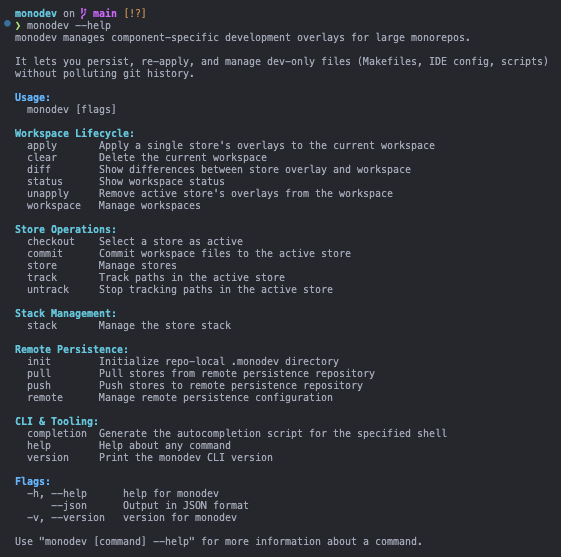
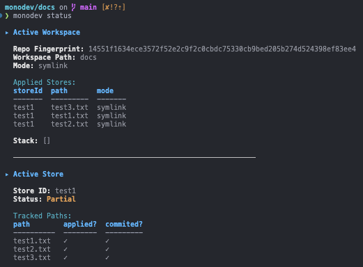

# monodev

Most codebases suffer from "local file drift." We generate debug scripts, AI scratchpads (.cursorrules, .claude, etc.), and task notes that live alongside our code but don't belong in the repo. These files are either accidentally committed (clutter) or deleted too soon (lost knowledge).

`monodev` introduces a third space: **Local-First Overlays**. It keeps your dev-only artifacts persistent and portable without ever leaking them into your Git history.

The Monodev Way:
- **Invisible**: Keeps "git status" clean.
- **Persistent**: Your notes, scripts, and agent files survive branch switches.
- **Portable**: Push/Pull your local state via separate orphan branches.

---

## Quick Start

Platform support: macOS (Apple Silicon and Intel), Linux (AMD64 and ARM64).
Tagged releases publish a versioned `tar.gz` archive for each supported target
plus a `SHA256SUMS` file. The release workflow runs `monodev version` on each
target's native runner; Linux targets also run the filesystem and real-Git
integration suite before their archives are released.

```bash
# 1. Install
brew install danieljhkim/tap/monodev

# Or download the archive matching your OS and CPU from GitHub Releases,
# verify it with SHA256SUMS, and place the contained monodev binary on PATH.

# 2. Create your first store and track a file
monodev checkout -n my-debug-tools
monodev track debug_helper.py
monodev commit --all

# 3. Remove the overlay after done working
monodev unapply

# 4. Reapply again later when needed
monodev apply

monodev help
```

Downloaded release archives also contain shell completions under
`completions/` and man pages under `man/`. After extracting an archive, install
the binary and the optional integrations for your shell:

```bash
PREFIX="${PREFIX:-$HOME/.local}"
DATA_DIR="${XDG_DATA_HOME:-$HOME/.local/share}"
mkdir -p "$PREFIX/bin" "$DATA_DIR/bash-completion/completions" \
  "$HOME/.zfunc" "$HOME/.config/fish/completions" "$DATA_DIR/man/man1"
install -m 0755 monodev "$PREFIX/bin/monodev"
install -m 0644 completions/monodev.bash \
  "$DATA_DIR/bash-completion/completions/monodev"
install -m 0644 completions/_monodev "$HOME/.zfunc/_monodev"
install -m 0644 completions/monodev.fish "$HOME/.config/fish/completions/monodev.fish"
install -m 0644 man/monodev.1 "$DATA_DIR/man/man1/monodev.1"
```

Add `fpath=(~/.zfunc $fpath)` to `.zshrc` before `compinit` for zsh, and add
`${XDG_DATA_HOME:-$HOME/.local/share}/man` to `MANPATH` if your system does not
already search it. The Homebrew formula installs these same files automatically.



---

## Core ideas

### **Stores**
A **store** is a named, reusable snapshot of **dev-only files** (editor config, scripts, agent instructions, Makefiles, etc.).

- A store defines *what* files are overlaid and their contents
- Stored at: `~/.monodev/stores/<store-id>/`

You can think of a store as a portable bundle of development artifacts that can be applied across multiple components or sessions.

### **Workspaces**
A **workspace** represents a specific directory within a repository where overlays are applied.

- Each workspace tracks:
  - the active store
  - which stores are currently applied
- Workspace IDs are derived from:
  - the repository fingerprint (durable repo ID, else a normalized git remote URL)
  - the relative path within the repo
- Stored at: `.monodev/workspaces/<workspace-id>.json`
- See [docs/workspace-identity.md](docs/workspace-identity.md) for the full rule, including multiple remotes, moved clones, and repair.
- Running parallel coding agents in `git worktree`s of the same repo? See [docs/worktrees.md](docs/worktrees.md) for what's shared (stores) versus per-worktree (the applied-overlay ledger).

> **In short:** stores define *what* dev artifacts exist, and workspaces define *where* and *when* they are applied.

### Concurrency and locking

Monodev coordinates local processes with advisory file locks under each state
root's `.locks/` directory. A mutating command holds the lock for the complete
read, plan, filesystem mutation, and JSON save sequence—not only for the final
write.

- Locks are scoped per workspace and per store, so unrelated workspaces and
  stores can proceed concurrently.
- Operations that need both acquire the workspace first, then store locks in
  canonical path order. Multi-workspace operations sort workspace IDs first.
- Lock acquisition is bounded to two seconds. Contention returns an actionable
  `resource lock contention` error instead of waiting indefinitely.
- Locks are attached to open file descriptors, so the operating system releases
  them if a process exits or crashes. The `.lock` file may remain and is not an
  indication that a lock is still held.
- Composite read-only commands such as `status`, `diff`, and resource
  `describe` use shared locks with the same bound. Simple listings read each
  atomically replaced JSON file as an individual consistent snapshot.

---

## Basic workflow

### Basic create, track, commit & apply:

```bash
# create and check out a store (similar to `git checkout` but doesn't apply overlays yet)
# this also sets the store as "active store" for the current directory
monodev checkout -n my-component-store 

# track dev-only files for the "active store" (similar to `git add`)
monodev track Makefile .cursor scripts/dev .claude .vscode

# check status of the current workspace
monodev status

# persist the tracked files to the store (similar to `git commit`)
monodev commit --all

# check for modified tracked files
monodev diff
# if you want to commit the changes, you can do:
monodev commit --all

# removes the "active store" overlays from the current directory
monodev unapply

# later, in another component directory:
monodev checkout my-component-store
monodev apply # this will add those artifacts to the current dir
monodev unapply # this will remove the overlays from the current dir
```

### How it works

When you invoke `monodev checkout <store-id>` under a specific directory within a repo, a workspace file is created in `.monodev/workspaces/<workspace-id>.json`. This file contains the metadata for the workspace, including the active store, the applied stores, and the tracked paths.

The `workspace-id` is derived from the repo fingerprint and the relative path to the workspace. The fingerprint prefers a durable repo ID written by `monodev init` (or on first use in a remote-less repo); otherwise it hashes a normalized remote URL (`git@host:org/repo` and `https://host/org/repo.git` are the same). The clone's absolute path is not part of the fingerprint, so moving a clone does not orphan workspace state. When you cd into a different directory, you will not have an "active store" for that directory. When you cd back to the original component directory, the active store is restored. If a remote change still orphans a workspace, `monodev workspace repair` lists and rebinds it. See [docs/workspace-identity.md](docs/workspace-identity.md). 

When you invoke `monodev apply` with the active store, the overlays are applied to the current directory. This is done by creating copies of the tracked paths to the current directory.

You can use `monodev status` to see the current workspace status and applied overlays.



---

## Commands

### Core commands

These are the core commands you will use most often. You can still apply multiple store overlays using these commands multiple times. 

When there are conflicts (i.e. multiple stores claim the same path), you can use `--force` to override them. When conflicts are overridden, your latest actions (unapply, apply) will take precedence.

```bash
# this shows the current workspace status and applied overlays
monodev status

# this lists all available stores
monodev store ls

# this shows the detailed metadata and tracked paths for a store
monodev store describe <store-id>

# this deletes a store and all its overlay artifacts
monodev store rm <store-id>

# this sets the active store (store must already exist)
monodev checkout <store-id>

# this creates a new store and sets it as the active store
monodev checkout -n <store-id> [--description "some details"]

# this tracks a path in the active store (.monodev/<store-id>/track.json is updated)
monodev track <path>

# this untracks a path in the active store (.monodev/<store-id>/track.json is updated)
monodev untrack <path>

# update the active store metadata
monodev store update <store-id> [--description "some details"]

# persist the tracked paths in the active store (.monodev/<store-id>/overlay is updated)
monodev commit <path>

# persist all tracked paths in the active store
monodev commit --all

# apply the active store's overlays to the current workspace
monodev apply [--force] [--dry-run]

# apply one or more stores in order; later stores win path conflicts
monodev apply store-a store-b [--force] [--dry-run]

# remove the active store's applied overlays from the current workspace
monodev unapply [--force] [--dry-run]

# remove overlays owned by specific stores; other applied stores remain
monodev unapply store-a [--force] [--dry-run]

# show the ordered applied set and path ownership
monodev status

```

### Workspace management

```bash
# list all workspaces
monodev workspace ls

# show detailed information about a workspace
monodev workspace describe <workspace-id>

# delete a workspace (omit the id to delete the current workspace)
monodev workspace rm [workspace-id]
```

### Diagnostics

`monodev doctor` checks monodev's on-disk state for drift and interrupted transactions: pending overlay transaction journals (see [docs/overlay-recovery.md](docs/overlay-recovery.md)), orphaned backup directories, ledger entries owned by a deleted store, workspaces whose checkout no longer exists, stale lock files, remote persistence misconfiguration, and drift between `.git/info/exclude` and the workspace ledger. It exits non-zero when problems remain, so it can be used in scripts and CI.

```bash
# report drift and interrupted transactions without changing anything
monodev doctor

# apply the safe repairs: roll back or complete a pending transaction,
# prune ledger entries for deleted stores, remove orphaned backups,
# and reconcile the managed exclude block
monodev doctor --fix
```

### Remote persistence

Share stores across machines and teams using Git-based remote persistence. Stores are pushed to a separate orphan branch (`monodev/persist` by default) to keep them isolated from your main repository history.

The orphan branch is visible to anyone with access to the repository and is not
encrypted. Treat it as organizational isolation, not secrecy: do not push
secrets or other sensitive artifacts without a separate protection mechanism.

```bash
monodev init # initialize the .monodev directory in the repository root

# Configure which Git remote to use for persistence
monodev remote use origin

# Show current remote configuration
monodev remote show

# Set a custom persistence branch (optional)
monodev remote set-branch monodev/custom

# Push existing stores to remote
monodev push <store-id>...

# Push the current workspace reference with stores
monodev push <store-id>... --with-workspace

# Push only the current workspace reference
monodev push --with-workspace

# Pull stores from remote (always verifies checksums; warns if a store has no manifest)
monodev pull <store-id>...

# Force pull (overwrite a local store whose content differs from what is being pulled)
monodev pull <store-id>... --force
```

**How it works:**

1. Remote configuration is stored locally at `.monodev/remote.json`
2. Stores are materialized to `.monodev/persist/stores/` before pushing
3. With `--with-workspace`, the current workspace reference is written to `.monodev/persist/workspaces/<workspace-id>.json`
   with `schemaVersion`, `workspaceID`, `repo`, `workspacePath`, `absolutePath`, `activeStore`,
   `activeStoreScope`, `appliedStores`, `mode`, and a `pathOwnership` summary
4. A separate Git repository is created at `.monodev/.git` with an orphan branch
5. The orphan branch is pushed to your configured remote
6. When pulling, stores are fetched and dematerialized to `~/.monodev/stores/`

This approach keeps persistence separate from your main Git history while leveraging Git's compression and deduplication.

---

## What monodev is (and isn't)

**Is**
- per-workspace dev overlay manager
- designed for monorepos and large codebases
- deterministic
- portable

**Is not**
- a build system
- a dependency manager
- a replacement for dotfiles or Nix

---

## Status

Early development. 

Built it for personal use, but contributions and design feedbacks are welcomed.

## License

MIT
