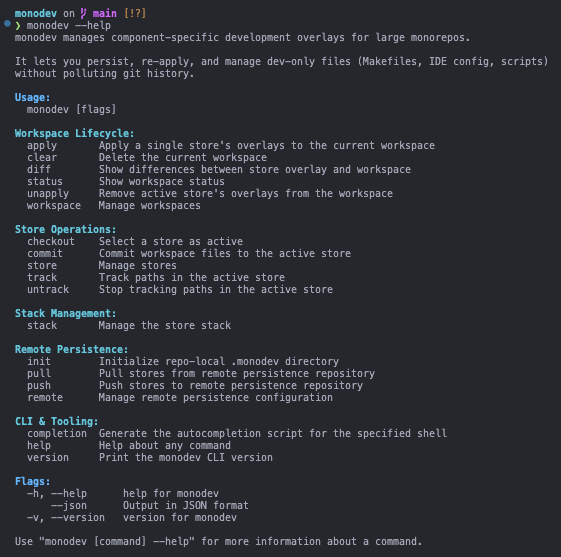

# monodev

Coding agents leave files in your repo that don't belong in git: `.claude/`,
`AGENTS.md`, `.cursorrules`, scratch scripts, local env files. Commit them and
they pollute history; delete them and you lose the context.

A monodev **store** keeps them outside git. Unapply them for a clean checkout,
and apply them again whenever you or an agent need them, hidden from git.

```console
$ git status --short
?? .claude/
?? .cursorrules
?? AGENTS.md
?? debug_helper.py
```

```bash
monodev checkout -n agent-context   # create and activate a store
monodev track --agents              # track the agent paths that exist
monodev track debug_helper.py
monodev save                        # snapshot tracked paths into the store
monodev unapply                     # remove them from the checkout
```

The files are gone and `git status` is clean. Bring them back later with:

```bash
monodev apply                       # restore them, hidden from git
```

`apply` copies the store's files into the working tree and lists them in a
managed block in `.git/info/exclude`, so they stay out of `git status` while
applied. Stores can be pushed to an orphan branch (`monodev/persist`) so they
follow you to other clones without touching `main`.



## Install

macOS and Linux only ([why not Windows](#platform-support)).

```bash
brew install danieljhkim/tap/monodev
```

Or download the archive for your OS and CPU from
[GitHub Releases](https://github.com/danieljhkim/monodev/releases), check it
against `SHA256SUMS`, and put `monodev` on your `PATH`. Archives also carry
shell completions (`completions/`) and a man page (`man/monodev.1`); Homebrew
installs both for you.

## Concepts

- **Store**: a named set of tracked paths and their contents. By default
  stores live in `<repo>/.monodev/stores/`, created on first use with a `*`
  `.gitignore`. Set `MONODEV_ROOT=$HOME/.monodev` to keep stores outside the
  repo, which also shares them across worktrees. Stores already in
  `~/.monodev` stay visible either way.
- **Workspace**: one directory in one checkout, with its active store and
  applied overlays. Its ID hashes the repo fingerprint and the path from the
  repo root, so a subdirectory is a separate workspace. See
  [workspace identity](docs/workspace-identity.md).

`track --agents` covers `.claude/`, `CLAUDE.md`, `.cursor/`, `.cursorrules`,
`AGENTS.md`, `.codex/`, `.gemini/`, `.aider*` and
`.github/copilot-instructions.md`, skipping any that don't exist.

## Agents

Two commands let coding agents use monodev on their own:

```bash
monodev skill init             # write a monodev SKILL.md, tracked and hidden from git
monodev context                # session start: find, restore and list agent context
```

`skill init` writes `.claude/skills/monodev/SKILL.md` (Claude Code) and/or
`.agents/skills/monodev/SKILL.md` (the Agent Skills layout Codex reads),
depending on which agent directories exist; `--target claude|agents|all`
overrides. It needs an active store, and leaves `git status` clean.

`context` reports the active store, or pulls and applies the stores pushed for
this directory (`push --with-workspace`), then lists the agent paths on disk.
It never pushes or forces, and finding nothing is not an error.

Agent notes and scripts are plain files in a store, by convention:

- `.agents/notes/lessons.md`: short durable lessons, edited in place.
- `.agents/notes/sessions/<date>-<agent>-<id>.md`: one file per session, so
  parallel agents never write the same file.
- `.agents/scripts/`: helper scripts.

Keep private, unreviewed or experimental context in monodev. Decisions that
bind everyone (ADRs) and gotchas true for every contributor belong in
reviewed, committed repo docs.

## Commands

```bash
monodev status                 # workspace, active store, applied overlays
monodev checkout <store>       # switch active store (-n to create)
monodev track <path>...        # add paths to the active store
monodev save                   # track new files under tracked dirs, then commit
monodev commit --all           # snapshot tracked paths (no discovery)
monodev diff                   # store vs working tree
monodev apply [store...]       # overlay; later stores win conflicts
monodev unapply [--all]        # remove the active store's (or every) overlay
monodev push / pull / sync     # share stores via the persistence branch
monodev eject                  # detach the workspace, keep the files
monodev context [--json]       # restore and list agent context for this directory
monodev skill init / show      # install or print the monodev agent skill
monodev doctor [--fix]         # diagnose and repair local state
```

`push` refuses payloads with detected secrets unless you pass
`--allow-secrets`.

Every flag: [docs/commands.md](docs/commands.md).

## Guides

- [Solo developer in a monorepo](docs/solo.md)
- [Sharing stores with a team](docs/team.md)
- [Parallel agents in git worktrees](docs/worktrees.md)
- [Recovering an interrupted apply/unapply/eject](docs/overlay-recovery.md)

## Platform support

Releases ship `tar.gz` archives for macOS (arm64, amd64) and Linux (amd64,
arm64). Each is smoke-tested on a native runner, and the Linux builds also run
the real-Git integration suite.

Windows isn't supported. State locking uses `flock(2)`, so the binary doesn't
compile there, and a Windows port would need that rewritten first (for example
with `LockFileEx`). No Windows port is planned.

## Status

Early development. I built it for my own use, but contributions and design
feedback are welcome.

## License

[MIT](LICENSE.md)
